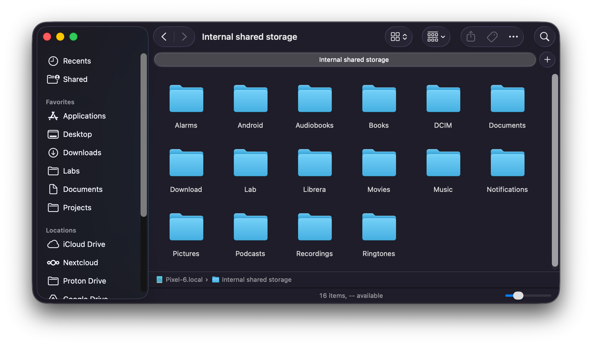

<!--
🚧 DRAFT — v0.4.0 website landing page 🚧

Filename + this top comment marked DRAFT for a reason: content assumes
v0.4.0's features as currently planned (per V0.4.0-DRAFT.md) and uses
image placeholders that need real screenshots once the v0.4.0
validation work is done. Promote to `WEBSITE.md` (or render to HTML at
`docs/site/index.html` if we're going the GitHub Pages route) when
v0.4.0 ships.

Structural inspiration: SwiftMTP's README serves as their landing page
(<https://github.com/Neighbor-Z/SwiftMTP>). The shape borrowed —
center-aligned logo, badge row, hero intro, features list, screenshot
grid, architecture sketch, Realized checklist, FAQ. Copy is original.

Image placeholders are marked with HTML comments so they're easy to
find. Each names what the shot needs to show.
-->

<p align="center">
  
</p>

<h1 align="center">Comprador</h1>

<p align="center">
  Your Android phone, mounted in Finder. No kernel extensions. No subscriptions. No Developer Options.
</p>

<p align="center">
  <a href="https://github.com/terraceonhigh/Comprador/releases/latest">Download</a> ·
  <a href="https://github.com/terraceonhigh/Comprador">Source</a> ·
  <a href="#faq">FAQ</a>
</p>

<p align="center">
  <a href="https://github.com/terraceonhigh/Comprador/releases/latest"></a>
  <a href="https://github.com/terraceonhigh/Comprador/blob/master/LICENSE"></a>
  
  
</p>

<!-- IMAGE: hero shot. A Finder window showing the Pixel 6 (or Xperia)
     mounted as a sidebar entry with the device's friendly name; Internal
     storage and SD card both visible at the root; the window shows
     DCIM/Camera with a few real photos. ~720px wide. -->
<p align="center">
  
</p>

---

## What's new in v0.4.0

Plug in. Pull down the notification shade. Tap **File Transfer**. Your
phone is in Finder.

That part hasn't changed since v0.1.0. But v0.4.0 is the release where
the mount path got *quiet* — fewer prompts, fewer running daemons,
fewer surprises.

### True concurrent multi-device

Plug in two phones (or a phone and a camera). Both appear in the
Locations sidebar at once. Browse one while the other transfers.
No "switch active device" dance, no per-app device picker, no
arbitrary one-at-a-time limit. Each device gets its own subprocess,
its own mount, its own quota — the architecture has been building
toward this for three releases.

<!-- IMAGE: two devices in Finder sidebar simultaneously. Show a
     Pixel and an Xperia (or any two distinct Android devices) as
     separate Locations entries, both browseable. Demonstrate that
     each has its own /Volumes/<DeviceName> path. ~720px wide. -->
<p align="center">
  
</p>

### Honest free-space numbers

Phones with an SD card report two quotas — one for Internal storage,
one for the SD card. Finder's "X GB available" string now reflects
which storage you're standing in, not a misleading sum. A 50 GB
drag onto a near-full SD card gets refused at the gate instead of
failing partway through.

<!-- IMAGE: get-info or df-h showing different "available" numbers for
     Internal storage vs SD card on the same phone. Side-by-side
     screenshots, ~360px wide each. -->
<p align="center">
  
</p>

### Phone-side changes surface in real time

Delete a file on the phone — through its own Files app, through a
camera app, through anything — and Finder catches up within a couple
of seconds. The mount used to freeze its view at session start;
now it reconciles against the device on every directory access.

### No phantom files

macOS Finder writes `._<name>` "AppleDouble" companion files
alongside every file you drop onto a non-HFS+ filesystem. Other
mount-as-volume tools commit them straight to the phone, so the
phone's Files app ends up showing two entries for every file you
transferred. Comprador silently accepts and discards them
server-side. Phone's view stays clean.

### Cleaner first launch

The privileged helper that v0.2 used for cosmetic Finder labels
is gone. v0.4.0 mounts the phone with `mount -t nfs` to a
loopback port — no LaunchDaemon, no Login Items approval prompt
on first launch, no `/etc/hosts` editing. The first time you
open Comprador after install: the icon appears in the menu bar
and that's the entire onboarding.

---

## How it works

**For Android phones**

1. Plug in your phone via USB
2. Pull down the notification shade → tap **File Transfer**
3. Phone appears in Finder sidebar

**For cameras (DSLRs, mirrorless — Canon, Nikon, Sony, Fuji, etc.)**

1. Plug in the camera via USB
2. If the camera asks, choose **PC / Computer** mode (sometimes
   called *MTP* or *PTP*)
3. Camera appears in Finder sidebar

That's it. No menu to find, no settings to configure, no
right-click ritual.

---

## Features

- **Mounts as a Finder volume** — open Finder windows, drag files,
  use Quick Look, run command-line tools. Same affordances as any
  other mounted volume.
- **Bi-directional transfer** — copy onto the phone, copy off it,
  via drag-and-drop, copy-paste, the `cp` command, anything else
  that talks to Finder.
- **Per-storage free space** — Internal and SD card report
  separately. Drag-onto-near-full-SD is refused at the gate, not
  partway through.
- **Phone-side change reflection** — delete a file via the phone's
  Files app and Finder catches up within seconds.
- **Concurrent multi-device** — two phones in the sidebar at once;
  parallel browsing and parallel transfers.
- **No phantom companion files** — AppleDouble `._*` writes are
  filtered at the mount layer; the phone never sees them.
- **Camera support** — any PTP-class device libmtp recognizes
  shows up the same way an Android phone does.
- **Signed and notarized** — first launch is a double-click; no
  Gatekeeper warning.
- **No kernel extension** — no SIP changes, no Gatekeeper
  approval, no privileged helper installation. The bridge is a
  userland binary that speaks NFSv3 to localhost.
- **No telemetry** — the bridge binds to the loopback interface
  and nowhere else. Nothing leaves your machine.

---

## Screenshots

<!-- IMAGE: menu bar icon states in a grid. Four cells:
       - idle: no device (basic externaldrive icon)
       - connecting: animated externaldrive (capture mid-pulse)
       - mounted: filled externaldrive
       - error: externaldrive with badge.xmark
     Each cell ~120px square; assemble into a 2x2 grid ~480px wide. -->
| Idle | Connecting | Mounted | Error |
|------|------------|---------|-------|
| <!-- IMAGE: menu_idle.png ~120px --> | <!-- IMAGE: menu_connecting.png ~120px --> | <!-- IMAGE: menu_mounted.png ~120px --> | <!-- IMAGE: menu_error.png ~120px --> |

<!-- IMAGE: menu open showing connected device with Show in Finder /
     Eject menu items. Capture with a phone actually mounted and the
     menu dropped. ~360px wide. -->

<p align="center">
  
</p>

<!-- IMAGE: a Finder window with the phone mounted, browsing
     DCIM/Camera, sidebar showing the phone as a Locations entry.
     ~720px wide. -->

<p align="center">
  
</p>

---

## Architecture

Three components, simpler in v0.4.0 than any release before it.

```text
Phone ←USB→ libmtp ←cgo→ Go bridge ←NFSv3 (localhost)→ Finder
                                ↑
                         hostname from
                       Settings.Global.DEVICE_NAME
                       (via libmtp friendly name)
```

**Go NFS Bridge** — a standalone binary that talks to the phone via
libmtp (cgo) and serves its filesystem over NFSv3 on a random
loopback port. macOS speaks NFSv3 natively, so no kernel extension,
no FUSE, no driver-signing dance. The bridge is the *only* moving
part that has to know about MTP.

**Swift Menu Bar App** — watches for USB devices via IOKit, spawns
a bridge per connected phone or camera, and mounts each bridge's NFS
endpoint as a Finder volume via `mount -t nfs`. Per-device
subprocesses mean two phones can coexist without sharing state.

That's the whole stack. No privileged helper. No kernel extension.
No WebDAV layer. No File Provider extension. No daemon to keep alive
when you quit the app.

See [`docs/ARCHITECTURE.md`](ARCHITECTURE.md) for the detailed
component diagram.

---

## Get it

[**Download the latest release.**](https://github.com/terraceonhigh/Comprador/releases/latest)
Open the `.dmg`, drag `Comprador.app` to Applications, eject the
disk image. First launch is a double-click.

### Requirements

- macOS 13 (Ventura) or later
- Apple Silicon Mac (M1 or newer)
- A data-capable USB cable (charge-only cables won't work — if your
  phone doesn't appear at all, swap the cable first)
- An Android phone, or a camera that exposes itself as a USB MTP/PTP
  device

### Build from source

```bash
brew install libmtp go

# With full Xcode installed:
make dist

# With only Command Line Tools (no Xcode):
make dist-swiftc

# Output: dist/Comprador.zip
```

See [`docs/BUILDING.md`](BUILDING.md) for the full build matrix.

---

## Realized

What's actually shipped, accumulated across releases:

- [x] Mount Android phones as Finder volumes (v0.1.0)
- [x] Bi-directional file transfer via Finder drag-and-drop (v0.1.0)
- [x] Create folders on the phone (v0.1.0)
- [x] Delete files and folders on the phone (v0.1.0)
- [x] Automatic mount on plug-in, unmount on unplug (v0.1.0)
- [x] Volume named after the device's friendly name (v0.1.0)
- [x] Camera support via PTP class match (v0.1.0)
- [x] "Start at Login" toggle (v0.2.0)
- [x] Apple-signed and notarized distribution (v0.2.3)
- [x] NFS mount path replaces WebDAV — sub-second mount time (v0.3.0)
- [x] Live re-enumeration: drag a file, see it appear without manual refresh (v0.3.0)
- [x] Recursive folder copies handled deeply (v0.3.0)
- [x] Per-storage quota for phones with SD cards (v0.4.0)
- [x] Phone-side change reflection within ~2 seconds (v0.4.0)
- [x] AppleDouble companion-file filtering (v0.4.0)
- [x] Concurrent multi-device support (v0.4.0)
- [x] Cleaner first launch — no privileged helper, no Login Items prompt (v0.4.0)
- [x] WebDAV mount path retired (v0.4.0)

---

## FAQ

**Where do my files actually live?**
On your phone. Comprador mounts a *view* — nothing is copied to your
Mac unless you drag a file into a local Finder window. Closing the
volume doesn't lose anything; opening it again shows the current
state of the phone.

**Does Comprador see my files? Are they uploaded anywhere?**
No. Everything is local: your phone over USB, Comprador as a small
NFS server bound to `localhost`, Finder as the NFS client. The
bridge binds only to the loopback interface — it can't be reached
from the LAN, let alone the public internet. No cloud, no telemetry,
no internet round-trips.

**Does it work over Wi-Fi?**
No. USB only. Wireless MTP exists but isn't widely supported on the
Android side, and adding it would roughly double the project's
attack surface for very little gain.

**Does it work with iPhones?**
No. iPhones don't speak MTP — they speak Apple's proprietary mobile
device protocol, handled by Image Capture / Photos / Finder sync.
Comprador is for *non*-Apple phones and PTP/MTP cameras.

**How do I uninstall?**
Drag `Comprador.app` from `/Applications` to the Trash. The Login
Item registration goes with it. No leftover daemons, no `/etc/hosts`
entries, no kernel state — v0.4.0 removed all of those.

**Finder shows the volume but no files (or transfers stall).**
The MTP session has gotten into a bad state, usually because the
phone slept or the cable wiggled. Menu bar icon → **Eject the
device**, unplug, replug. Comprador mounts fresh.

**Two phones with the same name?**
If you plug in two unconfigured Pixel 6s, both want to be
`Pixel-6.local` and macOS would normally complain. Comprador
disambiguates: the second device's mount gets a `-2` suffix and
the menu shows both with the suffix as well, so you can tell them
apart at a glance.

**How do I update?**
Download the latest `.dmg` from
[Releases](https://github.com/terraceonhigh/Comprador/releases/latest)
and replace the app in Applications. Sparkle-style auto-update is
on the roadmap; not in v0.4.0.

---

## Why not...

**ADB?** Requires enabling Developer Options (Settings → About →
tap the build number seven times). Too much friction for
non-technical users.

**macFUSE?** Requires a kernel extension, which means either
disabling SIP or navigating Gatekeeper approval flows that shift
with each macOS release. Not acceptable for a consumer app.

**Android File Transfer?** Abandoned by Google, buggy, 4 GiB
file-size limit, last meaningful update in years.

**File Provider API?** Designed for cloud storage backends with
pull-based REST flows. MTP's stateful, session-locked protocol
doesn't map well; sandboxing restrictions make USB device access
from a File Provider extension painful.

---

## Support

Comprador is free, GPL, and will stay that way. If it's saved you
the cost of a paid alternative, or just made your day slightly less
annoying:

- **Interac e-Transfer** (Canadian banking only) → `terrace@terrace.zone`.
  Auto-deposit is on, so no security question needed. Any amount is
  welcome and goes to ongoing project costs (Apple Developer Program
  renewal, code-signing, the domain).

To contribute code or testing, see [`CONTRIBUTING.md`](../CONTRIBUTING.md).

---

## License

[GNU General Public License, version 3 or later](../LICENSE).

Third-party components and their licenses (libmtp, `golang.org/x/net`,
the vendored `go-nfs`) are noted in [`NOTICES.md`](../NOTICES.md).

Comprador began as a fork of
[OpenMTP](https://github.com/ganeshrvel/openmtp) by Ganesh Rathinavel,
but no source from that project remains — the current codebase is a
clean reimplementation with a different architecture (Go NFS bridge +
Swift menu bar app, in place of OpenMTP's Electron + Node.js).

---

<p align="center">
  <sub>
    Need help? <a href="https://github.com/terraceonhigh/Comprador/issues">Open an issue.</a>
    Found a bug? Same place.
  </sub>
</p>
